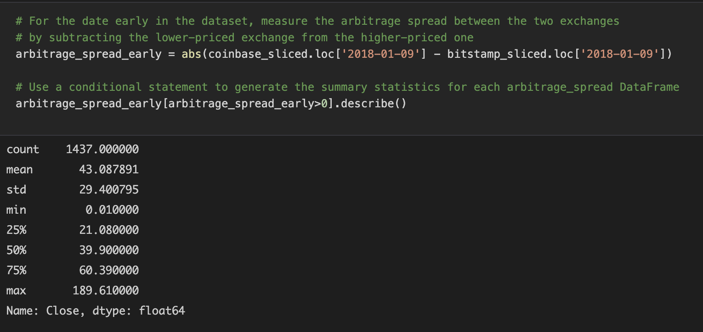
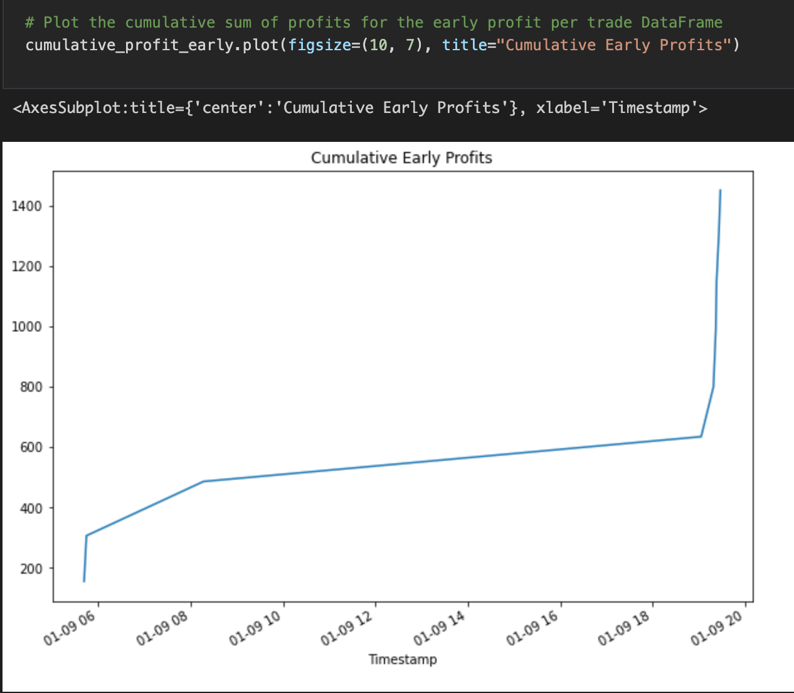

# **Crypto Arbitrage Project**

## **Analyzing the Profits from Arbitrage of Crypto using Bitstamp and Coinbase**

**Initial Assumptions**
Looking at the overlay plots of the two dataframes of Bitstamp and Coinbase over the four month time frame, from January 1, 2018 through April 1, 2018, I could see they both closely followed one another's trajectory. Therefore knowing this project was to calculate arbitrage which is defined in the async material as, "the almost-simultaneous purchase and sale of an asset to profit from a difference in the asset's price between markets", I made sure to look out for certain periods of time where the two graphs did not overlap one another too closely. 

I saw the beginning of the graph looked like there were many instances where the graphs were not entirely overlapping (spread) and some days in the middle of the graph that had day or two of spread and the end of the graph, the two markets, Coinbase and Bitstamp were practically meshing into one, indicating little to no difference in the price, and therefore little to no arbitrage spread. 


**After the Analysis**
Upon analyzing the data by going through various steps of calculating arbitrage spread at different time dataframes (early, middle and late) we were eventually able to calculate total profits at the beginning of the time frame, in the middle and at the end. 

It is interesting how simply from looking at the overlay plots and understanding arbitrage, how that tied into profits per trade and finally cumulative profits, which was calculated at a specific date. It was even more interesting to see the overlay plot and the initial assumptions from it being true and intertwining with total profit. The analysis shows that the early dataframe had more spread and therefore more cumulative profit, whereas the middle dataframe had very little profit and the late dataframe had none. 

Going through the following below steps for the early, middle and late dataframes, we were able to detemine whether arbitrage opportunities exist in the Bitcoin market by calculating the total profits.

 1. For each of the three dates, measure the arbitrage spread between the two exchanges by subtracting the lower-priced exchange from the higher-priced one. Then use a conditional statement to generate the summary statistics for each arbitrage_spread DataFrame, where the spread is greater than zero.



2. For each of the three dates, calculate the spread returns. To do so, divide the instances that have a positive arbitrage spread (that is, a spread greater than zero) by the price of Bitcoin from the exchange you’re buying on (that is, the lower-priced exchange). Review the resulting DataFrame.


3. For each of the three dates, narrow down your trading opportunities even further. To do so, determine the number of times your trades with positive returns exceed the 1% minimum threshold that you need to cover your costs.


4. Generate the summary statistics of your spread returns that are greater than 1%. 


5. For each of the three dates, calculate the potential profit, in dollars, per trade. To do so, multiply the spread returns that were greater than 1% by the cost of what was purchased. Make sure to drop any missing values from the resulting DataFrame.


6. Generate the summary statistics, and plot the results for each of the three DataFrames.


7. Calculate the potential arbitrage profits that you can make on each day. To do so, sum the elements in the profit_per_trade DataFrame.

```python
        profit_per_trade_early.sum()
```
8. Using the "cumsum" function, plot the cumulative "sum" of each of the three DataFrames. 



```python
        cumulative_profit_early = profit_per_trade_early.cumsum()

```

